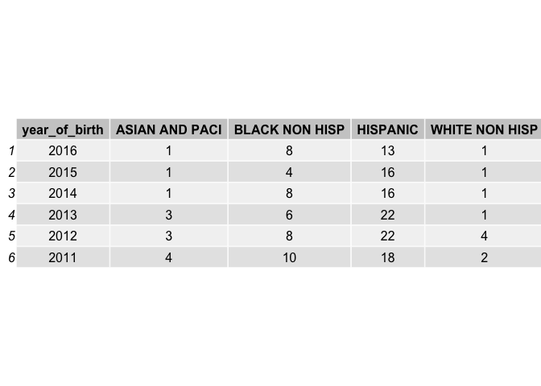
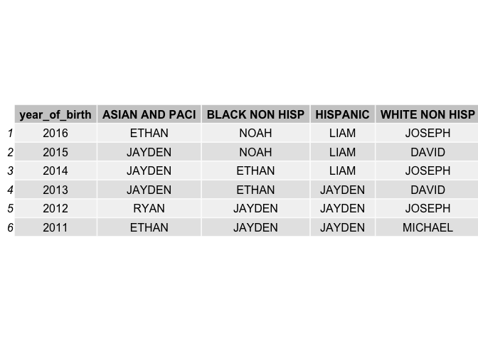
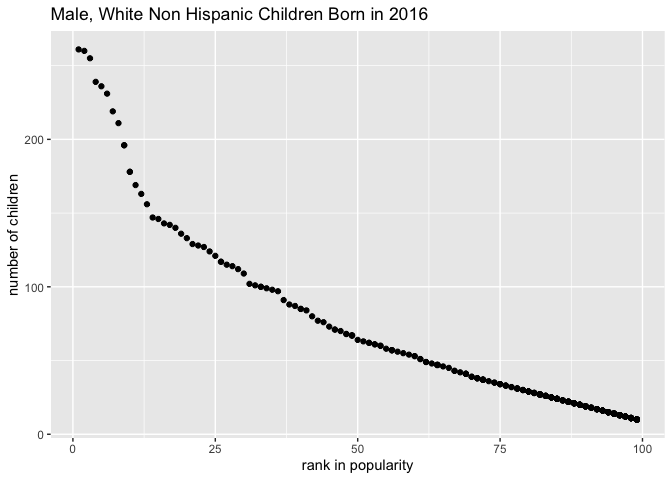

p8105\_hw2\_sl4659
================
Shenglin Liu
9/27/2019

## Problem 1

``` r
library(tidyverse)
```

    ## ── Attaching packages ──────────────────────────────────────────────────────────── tidyverse 1.2.1 ──

    ## ✔ ggplot2 3.2.1     ✔ purrr   0.3.2
    ## ✔ tibble  2.1.3     ✔ dplyr   0.8.3
    ## ✔ tidyr   1.0.0     ✔ stringr 1.4.0
    ## ✔ readr   1.3.1     ✔ forcats 0.4.0

    ## ── Conflicts ─────────────────────────────────────────────────────────────── tidyverse_conflicts() ──
    ## ✖ dplyr::filter() masks stats::filter()
    ## ✖ dplyr::lag()    masks stats::lag()

``` r
library(readxl)
library(tidyr)
library(gridExtra)
```

    ## 
    ## Attaching package: 'gridExtra'

    ## The following object is masked from 'package:dplyr':
    ## 
    ##     combine

``` r
# skip row 1 before reading any data
tw_df = read_excel("./data/HealthyHarborWaterWheelTotals2018-7-28.xlsx", sheet = 1, range = "A2:N338") %>%
# use reasonable variable names
  janitor::clean_names() %>%
# omit rows that do not include dumpster-specific data  
  drop_na(dumpster)
# round the number of sports balls to the nearest integer
tw_df$sports_balls = round(tw_df$sports_balls, digits = 0)
# convert the result to an integer variable
tw_df$sports_balls = as.integer(tw_df$sports_balls)

ppt18_df = read_excel("./data/HealthyHarborWaterWheelTotals2018-7-28.xlsx", sheet = 3, range = "A2:B14") %>%
  # use reasonable variable names
  janitor::clean_names() %>%
# omit rows without precipitation data  
  drop_na(total)
# add a variable year
ppt18_df$year = 2018

ppt17_df = read_excel("./data/HealthyHarborWaterWheelTotals2018-7-28.xlsx", sheet = 4, range = "A2:B14") %>%
  # use reasonable variable names
  janitor::clean_names() %>%
# omit rows without precipitation data  
  drop_na(total)
# add a variable year
ppt17_df$year = 2017

# combine precipitation datasets 
ppt_df = rbind(ppt17_df, ppt18_df)
# convert month to a character variable
ppt_df$month = month.name[ppt_df$month]
```

There are 285 observations in the tw\_df dataset and 19 observations in
the ppt\_df dataset. For the tw\_df dataset, weight is a key varialbe,
it indicates the amount of trash collected by the Trash Wheel. For the
ppt\_df dataset, total is a key variable, which indicates precipitation
in a given month. These are the two variables concerned in order to
verify that the amount of trash the device receives is highly dependent
on rainfall. The total precipitation in 2018 is 23.5 in. The median
number of sports balls in a dumpster in 2017 is 8.

## Problem 2

``` r
# read data from pols-month.csv
pols_df = 
  read_csv("./data/fivethirtyeight_datasets/pols-month.csv", col_types = "cdddddddd") %>%
  janitor::clean_names() %>%
  # break up the variable mon into integer variables year, month, and day
  separate(mon, into = c("year", "month","day"), sep = "-") %>%
  mutate(
    year = as.integer(year),
    month = as.integer(month),
    day = as.integer(day),
    # replace month number with month name
    month = month.name[month],
    # reate a president variable taking values gop and dem
    president = if_else(condition = prez_gop == 0, true = "dem", false = "gop"))
# remove prez_gop prez_dem and day
pols_df = select(pols_df,-prez_gop, -prez_dem, -day)

# read data from snp.csv
snp_df = 
  read_csv("./data/fivethirtyeight_datasets/snp.csv", col_types = "cd") %>%
  janitor::clean_names() %>%
  separate(date, into = c("month", "day","year"), sep = "/") %>%
  mutate(
    year = as.integer(year),
    month = as.integer(month),
    day = as.integer(day)) %>%
  arrange(year,month) %>%
  mutate(
    # replace month number with month name
    month = month.name[month]
  )
snp_df = select(snp_df, -day)
snp_df = snp_df[, c("year", "month", "close")]

# read data from unemployment
emp_df = 
  read_csv("./data/fivethirtyeight_datasets/unemployment.csv", col_types = "idddddddddddd") %>%
  pivot_longer(
    Jan:Dec,
    names_to = "month",
    values_to = "unemployment") %>%
  mutate(
    # match month abbreviation with month number
    month = match(month, month.abb),
    # replace month number with month name
    month = month.name[month])
names(emp_df) = c("year","month","unemployment")

# join the datasets
join1_df = left_join(pols_df, snp_df)
```

    ## Joining, by = c("year", "month")

``` r
result_df = left_join(join1_df, emp_df)
```

    ## Joining, by = c("year", "month")

The pols\_df dataset contains 822 observations of 9 variables related to
the number of national politicians who are democratic or republican at
any given time. The snp\_df dataset contains 787 observations of 3
variables related to Standard & Poor’s stock market index (S\&P) at any
given time. The emp\_df dataset contains 816 observations of 3 variables
related to percentage of unemployment at any given time. The resulting
dataset, namely result\_df, contains 822 observations from January 1947
to June 2015 related to information in the above three datasets with key
variables president, close and unemployment.

## Problem 3

``` r
names_df = 
  read_csv("./data/Popular_Baby_Names.csv", col_types = "icccii") %>%
  janitor::clean_names() %>%
  mutate(
    # convert all child's first name to all upper cases
    childs_first_name = toupper(childs_first_name),
    # unify categorical indicators
    ethnicity = replace(ethnicity, ethnicity == "ASIAN AND PACIFIC ISLANDER", "ASIAN AND PACI"),
    ethnicity = replace(ethnicity, ethnicity == "BLACK NON HISPANIC", "BLACK NON HISP"),
    ethnicity = replace(ethnicity, ethnicity == "WHITE NON HISPANIC", "WHITE NON HISP"),
    ethnicity = as.factor(ethnicity),
    gender = as.factor(gender))
# remove duplicate rows
names_df = distinct(names_df)

# create a dataframe for olivia
olivia_df = filter(names_df, childs_first_name == "OLIVIA", gender == "FEMALE") %>%
  select(year_of_birth, ethnicity, rank) %>%
  pivot_wider(
    names_from = "ethnicity", 
    values_from = "rank")
grid.table(olivia_df)
```

<!-- -->

``` r
# create a dataframe for male children
male_df = filter(names_df, gender == "MALE", rank == 1) %>%
  select(year_of_birth, ethnicity, childs_first_name) %>%
  pivot_wider(
    names_from = "ethnicity",
    values_from = "childs_first_name")
grid.table(male_df)
```

<!-- -->

``` r
# create a dataframe for scatterplot
wnh_df = filter(names_df, gender == "MALE", year_of_birth == 2016, ethnicity == "WHITE NON HISP") %>%
  select(count, rank)
ggplot(wnh_df, aes(x = rank, y = count)) + 
  geom_point() +
  ggtitle("Male, White Non Hispanic Children Born in 2016") +
  xlab("rank in popularity") +
  ylab("number of children")
```

<!-- -->
